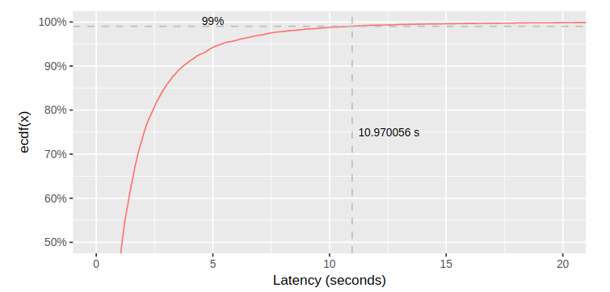

# Performance

## Throughput

Throughput (Thông lượng): là số hành động được thực hiện hay số kết quả được đưa ra trong một đơn vị thời gian.

## Latency

Latency (Độ trễ): là thời gian để thực hiện một số hành động hoặc để tạo ra một số kết quả.

## P99 Latency

Một cách đơn giản để tính P99, là sắp xếp giá trị và lấy giá trị thứ 99/100. Ví dụ, nếu bạn có 1000 giá trị latency, đặt chúng trong một mảng, và sắp chúng, sau đó lấy gía trị thứ 990. Đó sẽ là 99% tile, nó thể hiện giá trị latency là 99% thấp hơn.

    

## Reference

- [P99 Latency](https://blog.bramp.net/post/2018/01/16/measuring-percentile-latency/)
