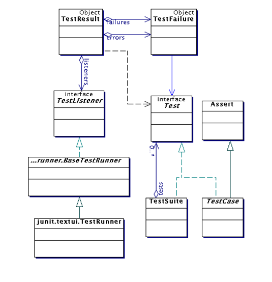

# Unit Test

## Giới thiệu về JUnit

JUnit là một framework đơn giản dùng cho việc tạo các unit testing tự động, và chạy các test có lặp đi lặp lại. Nó chỉ lafmoojt pahaafn của họ kiến trúc xUnit cho việc tạo các unit testing.

## Các khái niệm Unit Test

- Assertion: Là một phát biểu mô tả các công việc kiểm tra cần tiến hành, ví dụ: `AreEqual()`, `IsTrue()`,`IsNotNull()`, ... Mỗi một UnitTest gồm nhiều assertion kiểm tra dữ liệu đầu ra, tính chính xác của các lỗi ngoại lệ ra và các vấn đề phức tạp khác như:
  - Sự tồn tại của một đối tượng
  - Điều kiện biên: các giá trị có vượt ra ngoài giới hạn hay không
  - Thứ tự thực hiện các luồng dữ liệu.
- Test Point: là một đơn vị kiểm tra nhỏ nhất, chỉ chứa đơn giản một assertion nhằm khẳng định tính đúng đắn của một chi tiết code nào đó. Mọi thành viên dự án đều có thể viết một test point.
- Test Case: là một tập hợp các test point nhằm kiểm tra một đặc điểm chức năng cụ thể, ví dụ tòan bộ giai đoạn người dùng nhập dữ liệu cho đến khi thông tin được nhập vào csdl.
- Test Suite: Là một tập hợp các test case định nghĩa cho từng module hoặc hệ thống con.
- Regression Testing: Là phương pháp kiểm nghiệm tự động sử dụng một phần mềm đặc biệt. Cùng một loại dữ liệu kiểm tra giống nhau nhưng được tiến hành nhiều lần lặp lại tự động nhằm ngăn chặn các lỗi cũ phát sinh trở lại. Kết hợp Regression Testing với Unit Testing sẽ đảm bảo các đoạn mã mới vẫn đáp ứng yêu cầu thay đổi và các đoạn mã cũ sẽ không bị ảnh hưởng bởi các hoạt động bảo trì.

## Kiến trúc tổng quan

<div align="center">
    
</div>

## Cách viết một test case

- B1: Tạo maven project và thêm dependency vào file `pom.xml`:

```xml
<dependency>
      <groupId>junit</groupId>
      <artifactId>junit</artifactId>
      <version>4.12</version>
      <scope>test</scope>
</dependency>
```

- B2: Tạo class MyMath trong thư mục `main/java`:

```java

public class MyMath {
    public int add(int a, int b) {
        return a + b;
    }
}

```

- B3: Tạo class `TestAdd` trong thư mục `test/java`

```java
import org.junit.Assert;
import org.junit.Test;

public class TestAdd {
    @Test
    public void testOnePlusOneEqualTwo() {
        Assert.assertEquals(MyMath.add(1, 1), 2);
    }
}
```

## Reference

- [https://viblo.asia/p/testing-with-junit-in-java-dWrvwWODvw38](https://viblo.asia/p/testing-with-junit-in-java-dWrvwWODvw38)
- [https://viblo.asia/p/unit-test-la-gi-maGK7m3Llj2](https://viblo.asia/p/unit-test-la-gi-maGK7m3Llj2)
